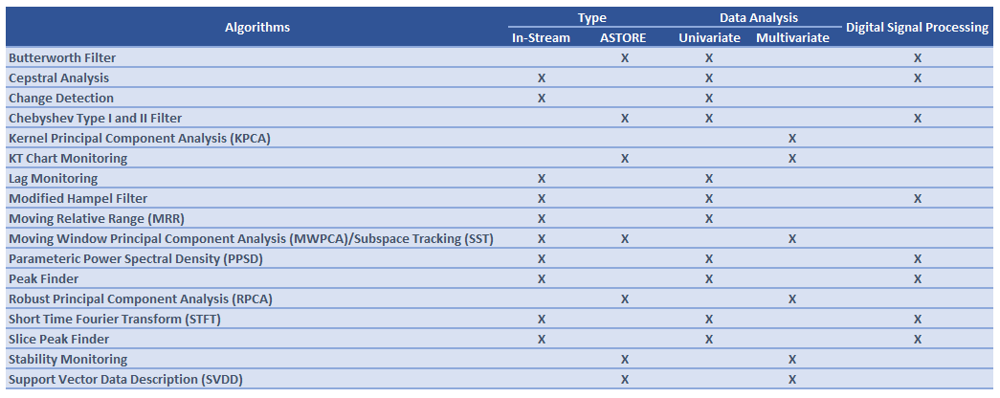

   

# AI and ML algorithms in IoT Applications

## Overview

Condition-Based Maintenance (CBM) can provide timely intervention which can significantly increase the lifetime and operational efficiency of high valued assets typically seen in IoT applications.  SAS Analytics for IoT provides meaningful analytics on vast amount of data generated across supply chains to derive value from the data and add analytical maturity. 
It supports multi-phase analytics for detecting deterioration or abnormal behavior in assets that generate high-frequency, high-dimensional data. It gives us flexibility to support a variety of offline models and deploy it in-stream for real-time scoring. In addition to offline model deployment it provides in-stream analytics execution on streams of events. 

Key take-aways:
*  Learn how to use high-frequency algorithms such as Subspace Tracking, Support Vector Data Description, etc.
*  Learn best practices and applications of high-frequency algorithms

## Anomaly Detection Methods

Most common AI models (especially deep learning) are strongly dependent on good training data. The important events that needs to be predicted are failure events and for sectors like manufacturing where six sigma practices have been widely implemented, most organizations strive to have fewer than 3-4 defects per million parts. The rarity of these defects makes it challenging to train models.

In this repository we will discuss anomaly detection methods which supports multi-phase analytics and is designed for rare events scenarios. Algorithms used to detect anomalies are mostly unsupervised learning methods.  

 
    

| Legend | Details |
| ------ | ------ |
| Type | Algorithm can be run **In-Stream** (online methods runs within SAS ESP) or **Offline** (built in SAS Studio, Model Studio, Jupyter notebook) but generates ASTOREs that can be used to deploy it in SAS ESP |
| Data Analysis | **Univariate** (one input) or **Multivariate** (multiple inputs) analysis |
| Digital Signal Processing | Signal data generated at high frequency and is continuous in nature |

_NOTE: Open Source algorithms are not included in this repository._

### Prerequisites

List of required software offered as part of [**SAS Analytics for IoT**](https://www.sas.com/en_us/software/analytics-iot.html) 
*  [SAS Visual Data Mining and Machine Learning](https://support.sas.com/en/software/visual-data-mining-and-machine-learning-support.html#documentation)
*  [SAS Visual Forecasting](https://support.sas.com/en/software/visual-forecasting-support.html#documentation) 
*  [SAS Event Stream Processing](https://support.sas.com/en/software/event-stream-processing-support.html#documentation)

## Getting Started

*  **Subspace Tracking (SST)**
    * **Applications:** SST method is used to detect anomalies and degradation in systems that generate high-frequency, high-dimensional data. It is frequently used in the IoT world where data is gathered from many sensors that are connected to each other and have high correlation. This approach converts a set of correlated variables to a set of linearly uncorrelated variables known as principal components and tracks principal subspace over time. Because the first few principal components usually capture most of the variability in the data, they can be tracked over time to assess whether any changes have taken place in the subspace that is spanned by the data. It is very effective with rare events. It can monitor floodlight systems to identify and alert on faulty lights, detect defective panels in solar farms, and monitor degradation in wind turbines. It can also be used for dimensionality reduction.
    * [Best Practices](docs/sst.md)  
    * **GitLab Repositories to try**
        *  [Anomaly Detection in Floodlights for Smart Campus](https://github.com/sassoftware/iot-anomaly-detection-floodlights)
        *  [Detecting Degradation in Wind Turbines](https://github.com/sassoftware/iot-detecting-degradation-wind-turbine)
*  **Support Vector Data Description (SVDD)**
    * **Applications:** SVDD algorithm is a one-class classification technique that is useful in applications where data that belongs to one class is abundant, but data about any other class is scarce or missing. Fraud detection, equipment health monitoring, and process control are some examples of application areas where most of the data belong to one class.
In its simplest form, an SVDD model is obtained by building a minimum-radius hypersphere around the one-class training data. The hypersphere provides a compact spherical description of the training data. This training data description can be used to determine whether a new observation is similar to the training data observations. The distance from any new observation to the hypersphere center is computed and compared with the hypersphere radius. If the distance is more than the radius, the observation is designated as an outlier. Using kernel functions in SVDD formulation provides a more flexible description of training data. Such description is nonspherical and conforms to the geometry of the data. 
    * **GitLab Repositories to try**
        *  [Anomaly Detection in Air Handling Unit](https://github.com/sassoftware/iot-anomaly-detection-hvac)
*  **Moving Relative Range (MRR)** 
    * **Applications:** MRR provides a measure of volatility for a nonstationary time series, where the mean and the variance of the series change over time. For example, you could use MRR to detect electrical disturbances in the power grid caused by equipment failures and lightning strikes propagating through the network.  
*  **Short Time Fourier Transform (STFT)**  
    * **Applications:** STFT is commonly used to monitor the time-varying frequency content of a signal. This monitoring can enable early detection of machine faults and thus lead to more efficient machine maintenance. It has been applied widely in various time series analysis including speech, audio, machine vibration, EKG and EEG signal processing.
*  **Peak Finder** 
    * **Applications:** Peak Finder is a method that returns the indices and height of the peaks of a signal that satisfies the specified parameter conditions. It can be used to locate peaks and amplitude in ECG signals to compute heart rate variability.
*  **Slice Peak Finder** 
    * **Applications:** Slice Peak Finder is a method that returns the indices and height of peaks on an array field that satisfies the specified parameter conditions. It can be used along with STFT to locate fundamental frequency and its harmonics in audio signals.
*  **Parametric Power Spectral Density (PPSD)** 
    * **Applications:** Parametric power spectral density estimation is to estimate a signal’s power spectral density by assuming underlying stationary stochastic process in which the data is generated has a certain structure and it can be described using a small number of parameters. Autoregressive moving average (ARMA) estimation is a parametric estimation method which assumes the signal is the output of a stable and causal system with white noise as the input, where the variance of the input noise is σ^2. So the estimation of the power spectral density becomes essentially the estimation of the estimation of ARMA model coefficients. PPSD can be applicable in bioacoustics beehive monitoring, coughing sound identifications, etc. 
*  **KT Charts**
    * **Applications:** The KT chart monitoring method is intended to provide the means for monitoring high-frequency multivariate data. The method is based on the support vector data description (SVDD) algorithm that is applied to a moving window of observations. This enables you to reduce noise that can be present in high-frequency data and eliminates the need to monitor individual observations. KT chart monitoring has two steps:
        * Training, which is implemented in the KTTRAIN procedure. The training process uses the data from the normal operations to define the state of statistical control—that is, to determine the central tendency and the spread of the process. The KT chart training calculates the control limits for allowed deviations in both the central tendency and the spread of the process. The KT chart for monitoring the process center is called the a chart, and the KT chart for monitoring the process variation is called the R squared chart.
        * Monitoring, which is implemented in the KTMONITOR procedure. The monitoring process uses the data from the ongoing process to monitor the process for stability in both the central tendency and the spread by using the control limits that are calculated in the training step.
    KT Chart can be used for monitoring quality of industrial processes.
*  **Lag monitoring** 
    * **Applications:** The lag monitoring algorithm computes the cross-correlation between a target time series and one or more additional time series. Results contain the selected lags and computed cross-correlation values that correspond to minimum, maximum, and maximum absolute value cross-correlations for each of the variables. Lag monitoring could be applicable in an assembly line scenario, where downstream events typically lag upstream events by a fixed time. Changes in this could indicate an anomaly.
*  **Change Detection** 
    * **Applications:** With change detection, a stream of measures is monitored, and an alert is raised when values deviate from what is expected. This algorithm can be used for real-world acoustic event detection for surveillance or multimedia information retrieval.
*  **Cepstrum** 
    * **Applications:** A cepstrum results from taking the inverse Fourier transform of the logarithm of the estimated spectrum of a signal. It can be used to find out whether a signal contains periodic elements in seismic, speech, and radar signal processing. This method is very effective in digital speech processing to detect the pitch in the human speech signal and extract the transfer function of the vocal tract in voiced speech.            
*  **Robust Principal Component Analysis (RPCA)**
    * **Applications:** The RPCA procedure implements robust principal component analysis (RPCA) in SAS Viya. The RPCA procedure decomposes an input matrix into a sum of two matrices: a low-rank matrix and a sparse matrix. You can use the low-rank matrix to do feature extraction and use the sparse matrix to detect anomalies. Robustness in RPCA comes from the property that the principal components are computed from observations after removing the outliers—that is, from the low-rank matrix. Many applications of RPCA focus on the sparse matrix. One example is the extraction of moving objects from the background in surveillance videos. RPCA can be used in many areas, including image processing, latent semantic indexing, ranking, and matrix completion.
*  **Kernel Principal Component Analysis (KPCA**)
    * **Applications:** Kernel principal component analysis (kernel PCA) is a nonlinear form of principal component analysis. It uses the same basic idea as PCA; that is, it seeks to project the set of data onto a low-dimensional subspace that captures the highest possible amount of variance in the data. Whereas PCA performs a linear projection of the data onto a subset of the original space, kernel PCA uses a mapping function to embed the data in a high-dimensional reproducing kernel Hilbert space (RKHS) by a linear dimensionality reduction through the “kernel trick” in that space. Different kernels correspond to different mapping functions. This way, a nonlinear manifold (with respect to the original input space) can be found that contains the data. The applications of kernel PCA include nonlinear dimensionality reduction, nonlinear data classification, kernel principal component regression, image denoising, novelty detection, and so on.
    

## Contributing

This repository is not open for external contributions.

## License

This project is licensed under the [Apache 2.0 License](LICENSE).

## Additional Resources

* [General information](https://www.sas.com/en_us/software/analytics-iot.html) about SAS Analytics for IoT
* Reference information about the [SAS Visual Data Mining and Machine Learning procedures](https://support.sas.com/en/software/visual-data-mining-and-machine-learning-support.html#documentation) of SAS Visual Data Mining and Machine Learning
* Reference information about the [SAS Visual Forecasting procedures](https://support.sas.com/en/software/visual-forecasting-support.html#documentation) 
* Reference information about the [SAS Event Stream Processing Streaming Analytics](https://go.documentation.sas.com/doc/en/espcdc/v_020/espan/p1iyy8xvfytolsn16djcp243wkx3.htm) 
* Reference information about [how to deploy an ASTORE from SAS Model Manager in SAS Event Stream Processing (ESP)](https://github.com/sassoftware/iot-deploy-astore-from-model-manager-in-esp)
* SAS Support Communities [website](https://communities.sas.com/)
* You can find additional IoT use cases on the [SAS for Developers website](https://developer.sas.com/guides/iot.html)

